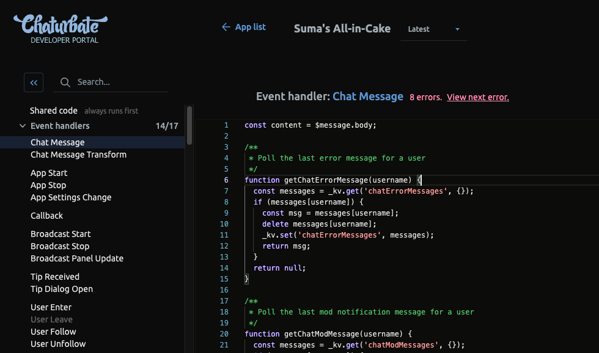
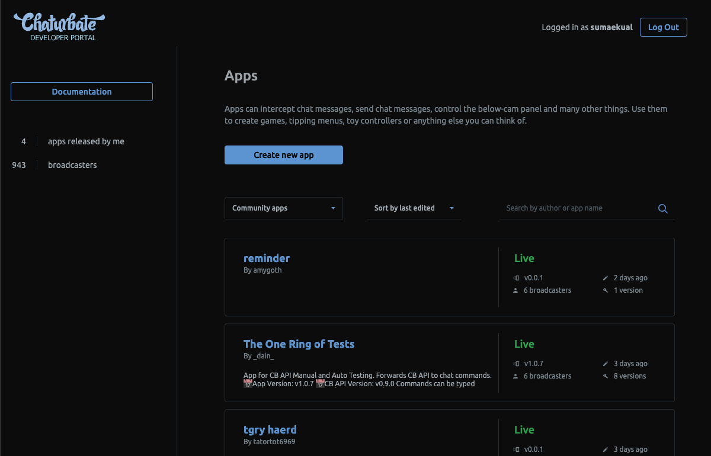
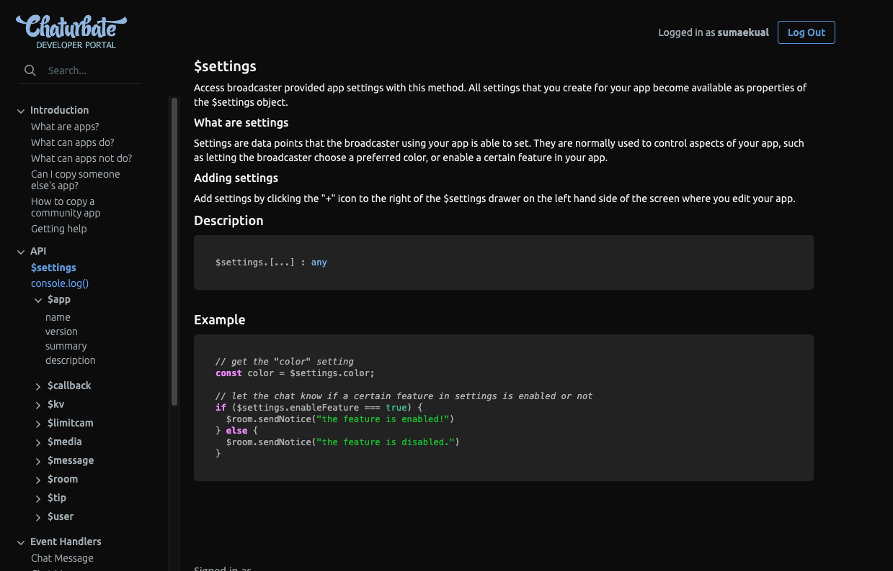

# Dark mode userscript for Chaturbate's new App IDE
A very silly dark mode userscript for Chaturbate's new app IDE.
Use with [Tampermonkey](https://www.tampermonkey.net/) or any compatible userscript manager.
This script just adds a bunch of CSS filters to invert the whole page,
and a bunch of others to fix images and fine-tune syntax highlighting.

## How to install
1. Install [Tampermonkey](https://www.tampermonkey.net/) or any compatible userscript manager
2. Import the userscript either by
  a. opening [cb-ide-darkmode.js](cb-ide-darkmode.js) and copypasting it into a new userscript, or
  b. importing the raw url [https://raw.githubusercontent.com/sumaeq/cb-ide-darkmode/main/cb-ide-darkmode.js](https://raw.githubusercontent.com/sumaeq/cb-ide-darkmode/main/cb-ide-darkmode.js)

## Known issues and drawbacks
- Emojis look a little weird, mainly their brightness/white-black values are f'd up

## Screenshots

## License
This userscript is licensed under MIT.
Feel free to fork and modify, and even send pull requests if you come up with some cool changes!